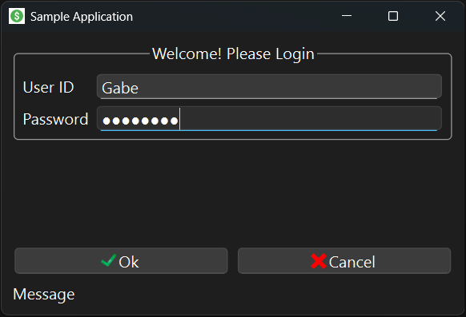
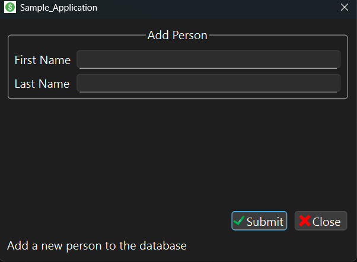

# Qt GUI Demo (PySide6)

This is a basic desktop application built with PySide6 and Qt Designer. It demonstrates a clean architecture for a multi-window GUI app, including:

- A login window with validation
- A main window with a menu bar
- A pop-up dialog for adding a new person
- Modular folder structure and signal-slot communication

---

## Preview

  


---

## Features

- PySide6 (Qt for Python) GUI framework
- Login form with signal-based authentication
- Dialog for adding a new person
- Icons and visual polish using Qt Designer
- Structured folder layout (Login, Main, Persons modules)
- Cleanly integrated UI `.ui` files with logic

---

## Getting Started

### 1. Clone the repository

```bash
git clone https://github.com/yourusername/qt-gui-demo.git
cd qt-gui-demo
```

### 2. Set up a virtual environment (optional but recommended)

```bash
python -m venv .venv
# On macOS/Linux:
source .venv/bin/activate
# On Windows:
.venv\Scripts\activate
```

### 3. Install dependencies

```bash
pip install PySide6
```

### 4. Run the app

```bash
python main.py
```

---

## Demo Login Credentials

- **Username:** `Gabe`
- **Password:** `password`

> You can update these in `Application_Login/Login.py`.

---

## 📂 Project Structure

```
.
├── Application_Login/
│   └── Login form logic and UI
├── Main/
│   └── Main window logic and UI
├── Persons/
│   └── Add person dialog logic and UI
├── Icons/
│   └── App icons (including screenshot previews)
├── main.py
├── .gitignore
└── README.md
```

---

## About the Author

I'm a student studying mathematics, transferring to university as a math/physics major with a computer science minor. I built this to showcase GUI development using Qt and Python.

---

## License

MIT License